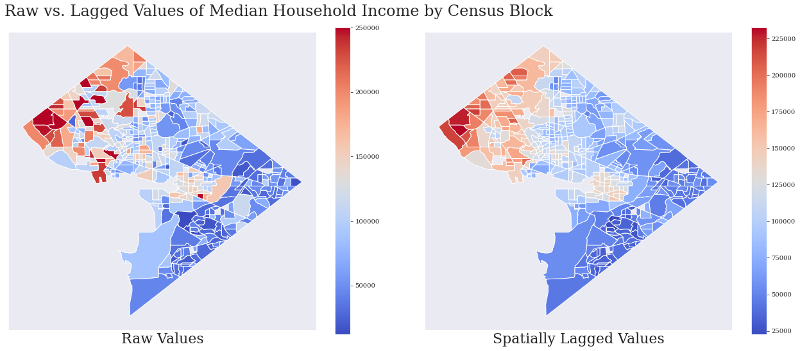

# Moran's DC: Exploring Spatial Autocorrelation at the Nation's Capitol

## Introduction

Autocorrelation is an important concept in statistics, and often needs to be accounted for when creating models. Simply put, autocorrelation can be defined as the correlation of some effect with a lagged copy of itself as a function of this lag. Informally, it is the similarity between observations as a function of the time lag between them.

Autocorrelation isn't always one-dimensional (e.g. a time series). For example, spatial autocorrelation is a correlation in a signal among nearby locations in a multidimensional space. Due to the multiple dimensions, it can be more difficult to account for and understand, but can also provide novel insights. For these reasons, spatial autocorrelation is going to be the topic of this post, which will explore some of the foundational aspects of the calculation through a case study of community health in Washington DC.

In particular, in this post I'm going to compare a custom "community distress index" with spatial autocorrelation features to see how well they match up. In the process, I'll explain some of the key points of how Moran's I (a measure of spatial autocorrelation) works.

To see the notebooks and code used to make all figures and implement the comparison, check out the [corresponding github repository](https://github.com/sawezo/moran_dc).

## Community Distress Index

The Economic Innovation Group (EIG) serves as a great example overview of what one can do by pulling down some Census data to analyze. The EIG focuses on a custom community distress index, which I will simplify for this post to use as a general template for making my own aggregative community measures for analysis. The 'DCI,' an index made to assess community health, uses data from the 5 Year ACS census over the following seven variables:

- <b>No high school diploma</b>: Percent of the 25+ population without a high school diploma or equivalent.
- <b>Housing vacancy rate</b>: Percent of habitable housing that is unoccupied, excluding properties that are for seasonal, recreational, or occasional use.
- <b>Adults not working</b>: Percent of the prime-age population (25-64) not currently in work.
- <b>Poverty rate</b>: Percent of the population living under the poverty line.
- <b>Median income ratio</b>: Median household income as a percent of the state’s median household income (to account for cost of living differences across states).
- <b>Change in employment</b>: Percent change in the number of jobs.
- <b>Change in establishments</b>: Percent change in the number of business establishments.

The index is calculated by ranking units per each variable, averaging the ranks, and then normalizing the average to a percentile. The communities are then grouped into quintiles and labeled (Prosperous, At Risk, etc.).   

## The Data

To go with what the EIG has already laid out, I decided to follow suit and also use five year ACS survey data, which has the added benefit of finer geographies. In addition, this data is more reliable/accurate in its estimates than the AC1 data. I also pulled US Census TIGER geospatial data (shapefiles) from the census website. I went with the most recent year of data, which was 2018.

With the geography and survey selection out of the way, I then identified a few initial features of interest to ping for in my calls. There are thousands of Census Bureau variables, but for this simple exploration I just wanted a few. I took inspiration from the DCI and identified variables that matched these closely. Notably, many variables can be further broken down (high school degree attainment per individual races, etc.), but I kept the variables high-level for now to keep the initial data and associated API calls simple. The final set of variables I chose were: 

- **No high school diploma rate**
- `B15003_017E`: estimated total with a regular high school diploma aged 25+
  - divide by `B01003_001E `: total population (used to get a proportion)

- **Housing vacancy rate**
  - `B25004_001E`: total estimate vacancy status
  - subtract `B25004_006E`: total estimate for seasonal, recreational or occasional usage
  - divide by `B01003_001E`: total population (used to get A proportion)
  
- **Median household income** 
- `B19013_001E`: median household income in the past 12 months (in 2017 inflation-adjusted dollars)

I also decided I would follow the DCI to aggregate these features and group each Census block in DC under one of four classes. From best to worst, they are "Prosperous", "At Risk", "Worst", and "Decent". 

## Spatial Autocorrelation

Now that I've described the data used, I can get into the meat of this post: spatial autocorrelation, and more specifically Moran's I. In this context spatial autocorrelation refers to the combination of two types of similarity:

1. *spatial* similarity
2. *attribute* similarity

When calculating Moran's I, these two similarities are combined to get an idea of how much a target feature changes over a region with respect to itself (that's the autocorrelation part). The fundamental objective is to visualize and statistically quantify a relationship between the target feature and geography.

Let's take our median household income feature for an example. First, I'll calculate spatial similarity by using the queen contiguity weighting scheme, which checks if an adjacency relationship exists between two polygons in space (i.e. if two Census block areas shares an edge or vertex). This is just going to create an binary square adjacency matrix where $\text{cell}_{i, j} = 1$ if area $i$ shares a border with area $j$, and zero otherwise. This is how we will measure similarity with respect to a spatial region.

Next, I'm going to measure similarity with respect to the target feature (median household income). 

This is calculated (for each area $i$) as:
$y_{\text{lag }i} = \sum_j w_{i, j} y_j$

where $w_{i, j}$ is a matrix of the spatial weights (row-standardized if continuous) that I calculated in the first step.

Mathematically, this is the <b>weighted sum of neighboring-district target feature values</b>, also known as 'spatial lag'. In the image below you can see the raw vs. lagged values for median household income in DC. the way I like to think of this is that we are 'ironing out' the hot-zones (in red) on the left. 

We should expect to see a change in the range (due to calculations when lagging the raw values) and a shift in the colors of some districts. It is expected that any high values (red in color) will 'spread' to the neighboring districts. Already we can see the contrast in median household income on both sides of the district.

This is a nice visual, but we still need to compare the two versions of the target (raw and spatially lagged) statistically to draw more reliable conclusions.

To recap, we now have calculated the raw target values versus the weighted sum of the target with respect to each area's neighborhood (the lagged values). To see if the geospatial aspect of this data affects the target variable distribution, we will statistically compare these two versions of the target feature.

#### Global Autocorrelation

To start, we study target feature over the scope of the entire map ('global'), with the goal of discovering any geographical clusters that exist.

In this case, we will consider the null hypothesis: 

- $H_0$: the data is completely spatially random (CSR)/no spatial autocorrelation

From here, we can use Moran's I testing to measure the correlation between a feature (raw target or lagged target) and the geographical space. The resulting statistic 𝑖 𝜖 [−1,1] tells us if the feature is perfectly dispersed (think of a chess board, where black and white cells alternate) or perfectly separated (one half of the chessboard only white squares, and another half only black). A value of 0 would be random correlation. 

In the case of median household income in DC, the statistic calculated came out to be about $0.61$.

From here, I take a computational approach and run a simulation to test significance. This is done because, due to the variability in geographical structures, analytical approaches to spatial autocorrelation are rather unreliable.

Here I assume the target feature to be CSR (Complete Spatial Randomness) distributed. I then calculate a Moran's I statistic for multiple (9,999) random bootstraps of the dataset and build up a distribution of statistics by repeating this process. Then I can see where the actual calculated statistic falls relative to this distribution to calculate a significance value respective to the CSR hypothesis. Below you can see the actual test statistic versus the expected Moran's statistic after bootstrapping if assuming normality.  

As you can see, the observed statistic was very far from the expected CSR distribution, thus we reject the null hypothesis in favor of the alternative (that the target feature distribution is not CSR). In this case the final P-value calculated was $0.0001$. Note this result applies to the map as a whole, as it is the **global** spatial autocorrelation.

#### Local Autocorrelation

Whereas global autocorrelation can be interpreted as finding overall clustering of the target feature distribution over an entire region, local autocorrelation looks to identify specific, clustered subsets of areas within the region. It is very similar to the global procedure, only it is performed over every individual geometric polygon (Census block) to get a significance measure for each. This can be further analyzed by turning to a local analysis where the attention shifts to detection of spatially correlated districts and spatial outliers.

Mathematically, the local Moran's I is simply the product of the target feature value and its spatial lag at a particular area. As a result, the global Moran's I we calculated above is the average rate of change of the local statistics. 

As before, here I take the computational approach (as the analytical is very unreliable for a small sample size like we have), which looks to use conditional permutations for each location. The conditional part here just means I hold out the target feature observation at a particular location $i$ (to avoid additional spatial dependency), and then randomly shuffle the remaining values before computing the local Moran value. This builds up a simulated reference distribution, and is done for each individual location.

From here, we can determine if each district is locally significant in terms of the target feature distribution, **relative to the other areas**. To make this result more interpretable, I group findings according to the quadrant of the Moran's I scatterplot they come from; this is explained in much more detail below.

To recap and put this all in context, the main objective here is to identify specific areas in the region that are driving overall patterns observed in the target feature.

### Moran's Scatterplot

By following the above procedure, we will end up with an array of local Moran's i statistics instead of a single global one like we did earlier. We can then plot these statistics, and, by using the mean dividing lines of each axis (the raw feature value and spatially lagged feature values), divide the two dimensional space into four quadrants. Each quadrant has a characteristic we may be interested in that can roughly characterize an area. They (with their characterizations) are:

- **1 (top right)**
  - there is a spatial association here (+, +)
  - points represent areas with high average target feature value surrounded by areas that also have high average
  - for simplicity, these will be referenced as 'diamond diamond' ('super nice')
  
- **2 (top left)**
  - there is no spatial association here
  - points represent districts with low average target feature value, but surrounded by districts with high average
  - for simplicity, these will be referenced as 'roughs in the diamonds'
  
- **3 (bottom left)**
  - there is a spatial association here (-, -)
  - points represent districts with low average target feature value surrounded by districts that also have a low average
  - for simplicity, these will be referenced as 'rough rough' areas
  
- **4 (bottom right)**
- there is no spatial association here
  - points represent districts with high average target feature value, but are surrounded by districts with low average
- for simplicity, these will be referenced as 'diamonds in the rough'

In technical terms, we can group these four quadrants into two supgroups:

- **spatial clusters**: quadrants one and three, where there is a spatial correlation (positive or negative)

- **spatial outliers**: quadrants two and four

Below is the Moran's scatterplot for median household income: 

 

Echoing the note about the global Moran's I being the average rate of change of the local statistics, one should note that the slope of the red regression line above is the global Moran's I.

### Comparison

I thought it would be interesting to see how well spatial autocorrelation (in particular, local Moran's quadrant assignments) match my custom DCI metric from the beginning of this post:

Interestingly, when using median household income for Moran's statistics, we see similar trends over both figures. This is especially true when contrasting the general trend: in both locations, the most prosperous areas are largely to the west, in sharp contrast with the below  

## Conclusion 

Moran's Spatial Autocorrelation is a great way to get more insight out of your data, and can . With the US Census making so much of its data available to the public (just sign up for a free API key!), the possibilities are endless. 

This post was motivated by the following links I'd recommend diving into if you want to learn more:

- https://eig.org/dci

- http://darribas.org/gds_scipy16/ipynb_md/04_esda.html (article on exploratory spatial analysis)

- https://readthedocs.org/projects/splot/downloads/pdf/stable/ (Python package 'pysal' documentation with methods, pg. 25: weight transformations, pg. 26: spatial lag, pg. 39: Moran's I, local Moran's I: 43)
- https://www.youtube.com/watch?v=_SmNHt4r79k (lecture on local autocorrelation)
- https://www.youtube.com/watch?v=kJXUUO5M4ok (@1:58:00, public talk on spatial analysis statistics)